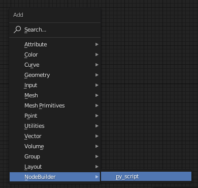

# Geonode builder

## What is it

Geonode builder is an experiment to see what a scripting language for geometry nodes could look like. It's not meant as a production level addon and will not see any maintenance/improvements once the experiment is over. Currently the scripting is bolted on top of python since it was the quickest way to get some results. For an actual "official" scripting node, a proper DSL will have to be designed, since the rate geonodes is adding features, it'll be only a matter of time until it's features cannot be neatly mapped on top of python anymore. 

## Expectation management

Given geonode builder is just an experiment there's plenty of "rough edges" large chunks of functionality are missing and I'm pretty sure there is also plenty of bugs to go around, as for docs, yeahh, well you have the code and this readme so there's that....

on top of that i'm not a "python guy" I wouldn't know a pep8 violation if it hit me in the face, I'm notoriously inconsistent with camelCase, PascalCase and snake_case. If writing quality python is your thing, prepare for a rage inducing experience, the python I write is absolute garbage level code.

Also expect lots and lots of debug prints to the console, yup i'm sloppy like that, they're still in, i like them, they stay  

That being said, the addon is in a "useful" state, it can do things, and the things you can do are much much faster than messing about with math nodes your self, on top of that code is easier to read, change, version, manage and you can even leave comments in code. It's so...so.... much better than trying to manage a graph with lets say more than 10 nodes. 

What I'm saying is code is better than graphs 

## Expectation management 2.0 : Hey hold up X is missing I need X, how could you not implement X, I NEED IT!

yeah.. happens...quite a bit I suppose, you could file an issue, but it is very unlikely I'm going to act on it, that being said those odds are not quite zero. 

# How does it work

The scription addon is a bit of meta programming, the pyhton script you feed to the node IS NOT THE CODE THAT WILL BE RUNNING DURING EVALUATION OF THE NODE TREE.

it's worth repeating so

DURING EVALUATION NO PYTHON CODE WILL RUN!

Hold up, then what does this thing do?

lets take the following script

```
input = nodes.Input("geometry","geometry")
translated = input + nodes.Vector(1,0,0)
nodes.Output("output", translated)
```

The scripting node, reads and executes the script observes the inputs and outputs of it and constructs the following nodegroup from it (you don't have to worry about the group the scripting node will wire it up in the back)


The nodegroups is generates are "unoptimized" there may be smarter ways to do things (like above here just put the translation into the transform node rather than conjuring up a vector) but performance is/was not a concern for this experiment.

# Getting started

Download and install the addon (you're on your own here, no handholding) once installed enable the `Geo Py Node` addon in the prefs panel (I am aware the name of this addon is rather inconsistent, not a priority for now) 

Note: the addon has been developed on top of blender 3.0, may work for 2.93/2, may not, don't know 

once installed and enabled, there should be a new menu item in the geometry nodes editor



add it to the graph and you'll have this little wonder


Now this node copies the UI from the other existing script nodes in blender, but it's lacking in functionality, any attempt to use an external script will be met with utter failure, it's not implemented. only internal scripts are supported.

So open up a text editor and add a new text document and call it `translate.py` and paste in the code above.

Then go back to the script node and select it from the drop down, the script node will now update its inputs and outputs.


Displayed above the scriptname (`geonodes.004` in this example) is the nodegroup it made for you in case you want to inspect it. (do note that no layout has been done on the nodegraph, all nodes are stacked on top of each other at 0,0, you may want to enable the `Node Arrange` addon to make it pretty for you)

If there were any errors during compilation, the UI will not notify you of this, keep an eye on the console.

# A larger example

The Mandelbrot is essentially the hello world of shaders, so why not.

```python
class Complex:
    def __init__(self, real,imag):
        self.real = real
        self.imag = imag
    
    def __add__(self, other):
        return Complex(self.real + other.real, self.imag + other.imag)
    
    def __mul__(self, other):
        return Complex(self.real * other.real - self.imag * other.imag, self.imag * other.real + self.real * other.imag)

    def __abs__(self):
        new = (self.real*self.real) + (self.imag*self.imag)
        return new.sqrt()

# this should be a switch node, but i haven't implemented that yet
def select(cond, val_true, val_false):
    vt = cond * val_true
    vf = (1.0-cond) * val_false
    return vt+vf

grid = nodes.primitives.grid(SizeX = 5, SizeY = 5, VerticesX=1500, VerticesY=1500)

z = Complex(0.0, 0.0)
c = Complex(grid.attributes.position.x, grid.attributes.position.y)
itr = 6 # low value chosen, higher values may require the new evaluator (will crash blender otherwise) that may not have landed yet
grid.attributes.escape_iter = 0
for x in range(itr):
    nz = z*z + c
    grid.attributes.escaped = abs(nz) > 2.0
    z = Complex(
            select(grid.attributes.escaped, z.real, nz.real),
            select(grid.attributes.escaped, z.imag, nz.imag)
        )
    grid.attributes.escape_iter = select(grid.attributes.escaped, grid.attributes.escape_iter , x)

grid.attributes.position.z = (grid.attributes.escape_iter/itr) * 0.4

grid.cleanattributes()
nodes.Output("geometry", grid)
```

Result (20 iterations used here):


be careful here as you increase the number of iterations the tree will use more and more nodes, very large trees take a VERY long time to generate in blender, this is a long standing issue, I [tried fixing it a few years ago](https://developer.blender.org/T46782) but that didn't quite made it through review.

Now before you go: LOOPS!! THERE'S LOOPS!

geo nodes does not support loops currently, this is a regular python loop that will just generate tons and tons of nodes

Don't even think an `if/then/else` construct will work.. (well it will but keep in mind WHEN this code runs, it runs while its generating the node group, if you keep that in mind you can use `if`'s ) 

# A word on Attributes

I'll just come out and say it attributes are a pain in the rear to use in geometry nodes right now, absolutely awful, the node tree you end up making is this long horizontal monster where if you look at it 2 days from now, you have no idea anymore what it is doing.

## We can do better!

```python
input = nodes.Input("geometry","geometry")
trans = nodes.Input("trans","vector")

#get an attribute, position is predefined
pos = input.attributes.position

# but others you can get to manualy
pos_manual = input.attributes.Vector("position")
flt_manual = input.attributes.Float("some_float_attribute")

#do some math with it
pos = (pos + trans)

#change a single component? not a problem!
pos.z = 2

#put it back to where it came from.
input.attributes.position = pos

#custom attribute name? easy as pie
input.attributes.my_attribute =  nodes.math.cos(input.attributes.position.x)

nodes.Output("geometry", input)
```

and it'll generate this lovely tree for you


## But wait, there's more!

best of all, all the temp attributes you'd normally use to store calculations, the addon knows what they are and cleans up after itself you just get the attributes you explicitly set!


